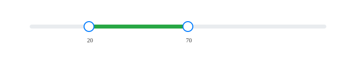
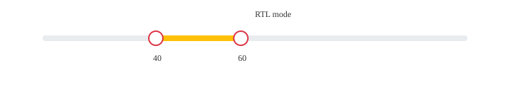

<!-- @format -->

<p align="center">
  <h1 align="center"> <code>react-multi-range-slider</code> </h1>
</p>

<p align="center">
    <a href="https://www.npmjs.com/package/react-multi-range-slider">
        
    </a>
    <a href="https://app.circleci.com/pipelines/github/ankushchavaninfo/react-js-multi-range-slider?branch=main">
        
    </a>
    <a href="https://github.com/ankushchavaninfo/react-js-multi-range-sliders">
        
    </a>
    <a href="https://github.com/callstack/react-native-slider/blob/main/LICENSE.md">
        
    </a>
</p>

<p align="center">
  React Js MultiRangeSlider component used to select a multi value from a range of values.
</p>

---

## Screenshots





## Installation

Install into your project:

```bash
npm i react-multi-range-slider
# or
yarn add react-multi-range-slider
```

---

## Quick start — Basic usage

```jsx
import React from "react";
import MultiRangeSlider from "react-multi-range-slider";

const App = () => {
  return (
    <MultiRangeSlider
      min={0}
      max={100}
      onChange={({ min, max }) => console.log(`min = ${min}, max = ${max}`)}
    />
  );
};

export default App;
```

---

## Examples

Controlled component example (manage values from parent):

```jsx
import React, { useState } from "react";
import MultiRangeSlider from "react-multi-range-slider";

function ControlledExample() {
  const [range, setRange] = useState({ min: 10, max: 80 });

  return (
    <div>
      <MultiRangeSlider
        min={0}
        max={100}
        value={range}
        onChange={(v) => setRange(v)}
        onChangeStart={(v) => console.log("start", v)}
        onChangeComplete={(v) => console.log("done", v)}
        step={1}
        minDistance={5}
      />
      <div>
        Selected: {range.min} - {range.max}
      </div>
    </div>
  );
}

export default ControlledExample;
```

Custom styling and color example:

```jsx
<MultiRangeSlider
  min={0}
  max={100}
  onChange={({ min, max }) => {}}
  trackColor="#eee"
  rangeColor="#28a745"
  thumbColor="#007bff"
  labelColor="#333"
  sliderStyle={{ width: 300 }}
  trackStyle={{ height: 8, borderRadius: 4 }}
  thumbStyle={{ boxShadow: "0 0 0 3px rgba(0,123,255,0.12)" }}
/>
```

RTL example:

```jsx
<MultiRangeSlider min={0} max={100} onChange={() => {}} direction="rtl" />
```

Disabled example:

```jsx
<MultiRangeSlider min={0} max={100} onChange={() => {}} disabled />
```

---

## Props / Features

This component supports the following props:

| Property                                                  | Description                                         |
| --------------------------------------------------------- | --------------------------------------------------- |
| `min`                                                     | Minimum numeric limit (required)                    |
| `max`                                                     | Maximum numeric limit (required)                    |
| `value`                                                   | Controlled values: `{ min, max }`                   |
| `defaultValue`                                            | Initial uncontrolled values: `{ min, max }`         |
| `onChange`                                                | Called on value change: `({ min, max })` (required) |
| `onChangeStart`                                           | Called when user starts dragging                    |
| `onChangeComplete`                                        | Called when user finishes dragging                  |
| `direction`                                               | `"ltr"` or `"rtl"`                                  |
| `step`                                                    | Step increment                                      |
| `minDistance`                                             | Minimum gap between thumbs                          |
| `allowOverlap`                                            | Allow thumbs to overlap (meet)                      |
| `disabled`                                                | Disable interaction                                 |
| `className` / `style`                                     | Wrapper class / inline style                        |
| `sliderStyle` / `trackStyle` / `rangeStyle`               | Inline styles for parts                             |
| `thumbStyle` / `labelStyle`                               | Inline styles for thumb and labels                  |
| `trackColor` / `rangeColor` / `thumbColor` / `labelColor` | Color overrides (string)                            |
| `ariaLabelMin` / `ariaLabelMax`                           | ARIA label overrides for accessibility              |

---

## Accessibility & Keyboard

- The thumbs expose ARIA attributes (`aria-valuemin`, `aria-valuemax`, `aria-valuenow`, `aria-valuetext`) and `aria-label` can be customized through `ariaLabelMin`/`ariaLabelMax`.
- Native range inputs provide basic keyboard support (arrow keys). For advanced keyboard UX you can extend the component to manage focus and handle key events programmatically.

---

## How to add images to README

1. If you want local images in the repository, create a folder such as `docs/images` and commit images there. Reference them with a relative path in Markdown:

```markdown

```

2. Or use hosted images (CDN or your website). Example using a URL:

```markdown

```

3. For package README on npm, make sure images are either remote URLs or included in the published package (update `files` in `package.json` if needed).

---

## Development / Contributing

Clone, install and build locally:

```bash
git clone https://github.com/ankushchavaninfo/react-js-multi-range-slider.git
cd react-js-multi-range-slider
npm install
npm run build
```

Run the examples in a small CRA or Next app by importing the built lib or using the local `src` implementation.

---

## Author & Links

- Website: https://www.ankushchavan.in/
- Repository: https://github.com/ankushchavaninfo/react-js-multi-range-slider

---

## License

ISC

---
